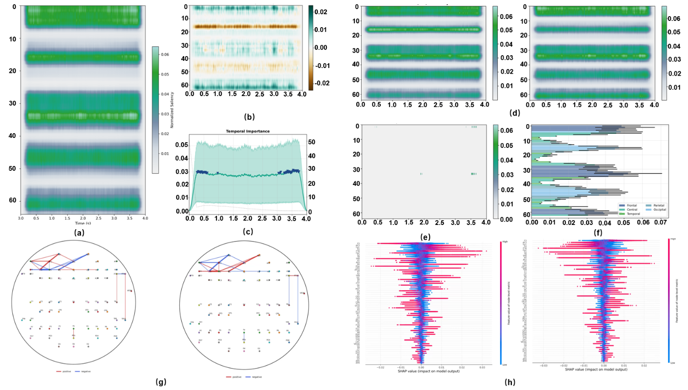

#  HACE-Net: coherence-preserving entropy-guided EEG neurophenotyping under multi-disease multi-center heterogeneity

Figure 1: Detailed architecture of HACE-Net for heterogeneous EEG screening.CP-PINN constrains five anatomical encoders to match the real-part channel-wise coherence of the input, yielding a coherence map that is co-modeled with RAW, PSD, wavelet, and nonlinear streams.GIEA conducts diagonal-Gaussian prototype reconstruction and inverse-entropy arbitration for sample-adaptive fusion, after which AnastomoGraph aggregates patch posteriors through quality-weighted graph components to produce subject-level predictions.

Figure 2: Baseline visualization across heterogeneous EEG datasets with two inference granularities.

Figure 3: Multi-granular interpretability of the PD--HC classifier across gradient- and coherence-based attributions.

Figure 4: Multibranch activation, saliency, and band-resolved coherence patterns across cohorts. (a) Normalized activation heatmaps from four representational branches (PSD, wavelet, nonlinear, coherence) for representative subjects in AD, MCI, FTD, PS, PD, and CN, reflecting pathway-wise response disparity under short-window inference.(b) Representative standardized multichannel EEG with gradient-based saliency overlays, accompanied by normalized scalp channel-importance maps and relative band-power topographies across $\delta$--$\gamma$, indicating spatially constrained, phenotype-aligned evidence rather than diffuse amplitude reliance.(c) Group-averaged channel--channel coherence matrices for PD and HC across $\delta$, $\theta$, $\alpha$, $\beta$, and $\gamma$, with differential maps $\Delta = \mathrm{PD} - \mathrm{HC}$, illustrating band-dependent coupling asymmetries consistent with connectivity-centered discrimination.

Figure 5: Integrated interpretability and reliability assessment of the proposed framework on the UNMPD146 PD/CN task.   (a) Raw-modality SHAP overlays for representative PD and CN samples, contrasted before versus after GIEA incorporation, highlighting the consolidation of salient channel--time segments. (b) ROC curve. (c) Precision--recall curve. (d) Normalized confusion matrix. (e) Calibration plot (reliability diagram) with ECE annotation. (f) Per-class Precision/Recall/F1 with macro-average summary. (g) Predicted-probability distributions for control (CN/HC) and PD, illustrating class-wise separation and confidence behavior

Figure 6: Feature-importance and minimal-counterfactual profiling of the UNMPD146 discrimination setting
